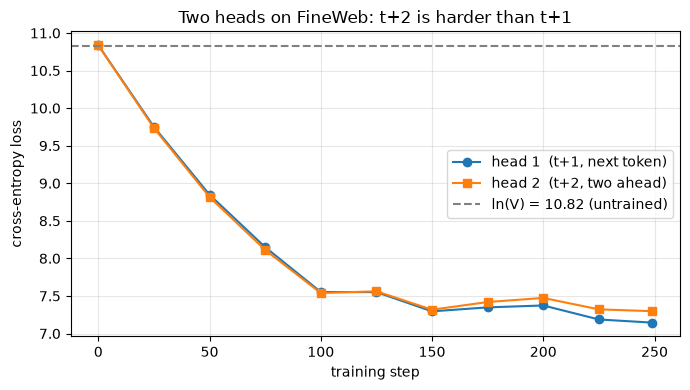

# Assignment 9 — The Loss Harness (nanoGPT / GPT-2)

Make the next-token training loss **correct and observable**, then add a second output head.

- **Architecture:** Andrej Karpathy's **nanoGPT / GPT-2** (pre-LN blocks, causal self-attention, GELU MLP, weight-tied head).
- **Data:** **FineWeb** (`HuggingFaceFW/fineweb`, `sample-10BT`) — *streamed*, so there is no multi-GB download.
- **Runs on:** Apple Silicon (MPS), CUDA, or CPU. Verified end-to-end on a Mac (MPS), **0 errors**.

📓 **Notebook:** [`Assignment9_loss_harness.ipynb`](./Assignment9_loss_harness.ipynb) — runs top to bottom.
🧾 **Full console log of a complete run:** [`assets/run_log.txt`](./assets/run_log.txt).
📈 **Part 2 loss curves:** [`assets/part2_loss_curves.png`](./assets/part2_loss_curves.png) (shown below).

> **The one warning this assignment is about:** a target shift in the *wrong* direction can still
> produce a beautiful loss curve, and it raises **no exception**. Most serious training bugs live in
> the few lines between the model output and the scalar loss. **Print the strings.** Part 3 proves it.

---

## Part 1 — the harness: the seven numbers

All values below are the **actual outputs** from the executed notebook (re-run to refresh).

### 1. Every tensor shape, each dimension named
```
tokens            (1, 64)          = (B batch, T sequence length)
hidden            (1, 64, 128)     = (B, T, C = n_embd hidden dim)
logits            (1, 64, 50257)   = (B, T, V = vocab size)
logits[:, :-1, :] (1, 63, 50257)   = (B, T-1, V)   predictions
tokens[:, 1:]     (1, 63)          = (B, T-1)      targets
flat_logits       (63, 50257)      = (B*(T-1), V)
flat_labels       (63,)            = (B*(T-1),)
loss (scalar):    10.8648
```

### 2. The shift, verified with STRINGS (not ids)
Position `i` reads input token `i` and must predict token `i+1`. Decoded side by side, it must read forward:
```
pos  INPUT (token i)   -> TARGET (token i+1)
  0  '|'               -> 'View'
  1  'View'            -> 'ing'
  2  'ing'             -> ' Single'
  3  ' Single'         -> ' Post'
  4  ' Post'           -> ' From'
Reconstructed from targets: 'Viewing Single Post From: Spoilers for the Week of February 11th|...'
```

### 3. Padding masked — the contributing-token count changes
Padding positions must not contribute. Using `cross_entropy(ignore_index=-100)`:
```
contributing tokens  raw = 10   masked = 6   (dropped 4 PADs)
loss  raw = 10.5423   masked = 10.7557
```

### 4. Two documents packed into one sequence — boundary masked
The last token of doc A illegitimately "predicts" the first token of doc B. That one cross-document target is masked:
```
boundary prediction: last-of-A must predict 'Photos' (first token of docB)
loss before masking boundary = 10.8708
loss after  masking boundary = 10.8359
```
**Why the difference:** the cross-document prediction is a target the model could never legitimately
know. Masking it removes an impossible, noisy term from the averaged loss.

### 5. Perplexity — an untrained model sits near the vocab size
Perplexity = `exp(loss)`. Untrained ≈ uniform → loss ≈ `ln(V)`, perplexity ≈ `V`:
```
untrained loss       = 10.8569
ln(vocab)            = 10.8249   <- expected loss
untrained perplexity = 51,891.1
vocab size           = 50,257    <- expected perplexity
PASS: within 25% of vocab size.
```
🐛 **This check caught a real bug.** With PyTorch's default init, untrained loss was ≈85 and
perplexity ≈1.8e37. The fix was nanoGPT's **std=0.02 initialization** — without it, tied logits blow
up. *If this number is wrong, you stop and debug before training anything.*

### 6. Tied vs untied head — parameter counts
```
tied   head : 7,234,432 params
untied head : 13,667,328 params
difference  : 6,432,896  = vocab_size * n_embd  (50257 * 128)
```

### 7. Peak memory — ordinary vs self-written chunked cross-entropy
The memory spike is the full `(B*T, V)` logits tensor. A chunked CE never materializes it:
```
naive   loss = 10.853460
chunked loss = 10.853460   (identical -> numerically correct)
peak naive   = 196.32 MB
peak chunked =  49.08 MB
ratio        = 4.00x lower peak   (= N/chunk = 1024/256)
```

---

## Part 2 — a second head predicting `t+2`

One shared backbone, two output heads:
- head 1 — `logits1[:, :-1]` predicts `tokens[:, 1:]` (next token, **t+1**)
- head 2 — `logits2[:, :-2]` predicts `tokens[:, 2:]` (two ahead, **t+2**)
- objective = `loss1 + loss2`

Trained 250 steps on FineWeb (≈12s on MPS):
```
step   0 | loss1(t+1) 10.838 | loss2(t+2) 10.835 | sum 21.673 | gap -0.002
step 100 | loss1(t+1)  7.553 | loss2(t+2)  7.539 | sum 15.092 | gap -0.014
step 175 | loss1(t+1)  7.348 | loss2(t+2)  7.419 | sum 14.767 | gap +0.071
step 249 | loss1(t+1)  7.145 | loss2(t+2)  7.298 | sum 14.443 | gap +0.152
```
**FINAL — loss1(t+1) = 7.145, loss2(t+2) = 7.298, sum = 14.443.**



*Both heads start on the dashed `ln(V) = 10.82` line (untrained). They descend together, then the
orange t+2 curve separates and stays above the blue t+1 curve — the widening gap is the whole point.*

**What happens over training:** both heads leave `ln(V)` together, but the t+2 head's loss stays **at
or above** the t+1 head's, and the gap **widens** (−0.002 → +0.152). Predicting two tokens ahead is
strictly harder — the next-token head keeps capturing easy local structure (finishing a word, closing
punctuation) that carries no equivalent signal two tokens out. Same backbone, so this is a clean
comparison of *task difficulty*, not model capacity.

---

## Part 3 — the demonstration: the off-by-one trap

I deliberately shifted the targets the **wrong** way (predict `t-1` instead of `t+1`). The loss falls
into a smooth, convincing curve — and **no exception is raised**:
```
Training with a WRONG (backwards) shift:
  step   0 | loss 10.851   <- looks like it is 'learning'!
  step  60 | loss  8.383   <- looks like it is 'learning'!
  step 149 | loss  7.164   <- looks like it is 'learning'!
```
Then I printed the strings:
```
pos  INPUT (token i)  model predicts   CORRECT next (i+1)
  0  '|'              ' the'           'View'
  1  'View'           '.'              'ing'
  2  'ing'            ')'              ' Single'
```
The **model predicts** column doesn't match the **CORRECT next** column at all. With a wrong (backwards)
shift, each position is asked to predict the *previous* token — which the causal model has **already
seen** in its context — so the "loss" measures a trivial copy task, not prediction. It falls smoothly
because copying is easy, while the model never learns to predict the future. The loss looked healthy;
the strings show it was optimizing the wrong task.
**This is why Part 1.2 prints strings — it is the only check that catches a reversed shift.**

---

## Key takeaways
- A falling loss curve is **not** proof the harness is correct. Observe everything.
- **Print the strings**, never the token ids — an off-by-one is invisible in integers.
- **Untrained perplexity ≈ vocab size** is the fastest bug detector you have (it caught the init bug).
- **Mask** padding and cross-document boundaries, or they silently corrupt the loss.
- **Chunked cross-entropy** cuts peak memory (4× here) for an identical loss.
- Predicting further ahead (t+2) is genuinely harder, and the loss gap makes it visible.

---

## Run it

**On a Mac (local):**
```bash
python3 -m venv .venv && source .venv/bin/activate
pip install torch tiktoken datasets matplotlib jupyter
jupyter notebook Assignment9_loss_harness.ipynb        # then Run All
```
On Apple Silicon the notebook auto-selects **MPS**. FineWeb is streamed (~80k tokens); if the Hub is
unreachable it falls back to a small built-in corpus so the notebook still runs end to end. Optionally
`export HF_TOKEN=...` to avoid Hub rate limits.

**On Google Colab:** upload the `.ipynb`, then **Runtime → Run all** (the first cell installs deps).
