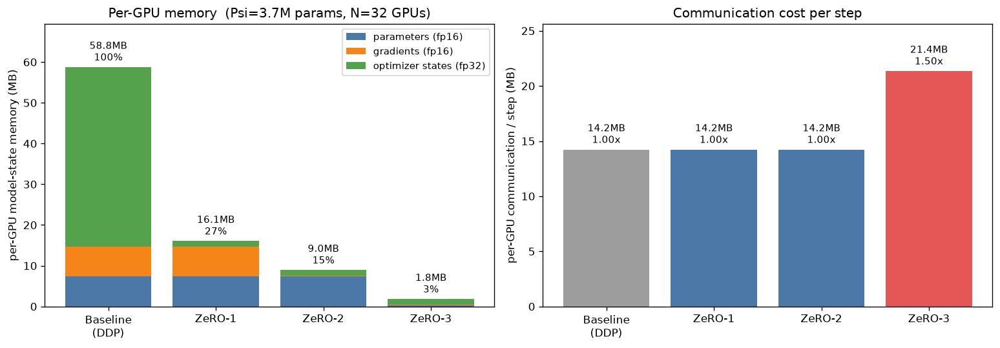
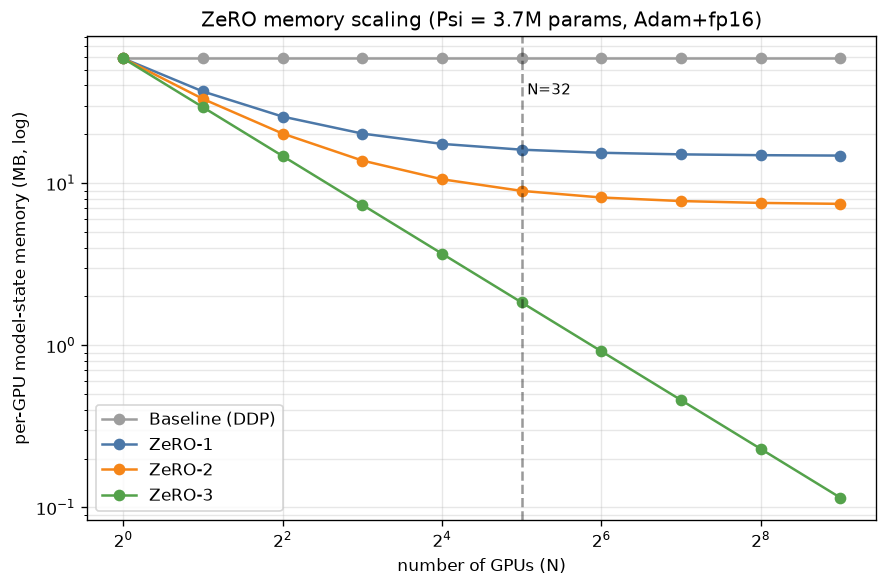

# Distributed Training — Simulating ZeRO-1 / ZeRO-2 / ZeRO-3 on 32 Virtual GPUs

Build **32 virtual GPUs** (backed by CPU threads), run a real training step of a demo model on top
of them, and **simulate the ZeRO (Zero Redundancy Optimizer) family** — showing exactly how per-GPU
**memory** and **communication** change as we move from plain data parallelism to ZeRO-1, ZeRO-2 and
ZeRO-3.

📓 **Notebook:** [`ZeRO_simulation.ipynb`](./ZeRO_simulation.ipynb) — runs top to bottom, **0 errors**, on CPU.
🐍 **Same simulation as a script/library:** [`zero_sim.py`](./zero_sim.py) + [`run_sim.py`](./run_sim.py).
📈 Figures below are produced by the notebook into [`assets/`](./assets).

> **The headline result (Ψ = 3.67 M params, N = 32 GPUs, Adam + fp16):** per-GPU model-state memory
> drops from **58.8 MB → 1.8 MB (a 32× cut)**, ZeRO-3 reproduces the DDP weight update **bit-for-bit**,
> and it costs only **1.5×** the communication.

---

## 1 · The problem ZeRO solves

In standard **data parallelism (DDP)**, every GPU holds a *full, redundant copy* of the entire model
state. With mixed precision + the **Adam** optimizer, "model state" is much bigger than just the
weights. Per parameter, **every** GPU stores:

| component | dtype | bytes / param |
|---|---|---:|
| parameter (for fp16 compute) | fp16 | **2** |
| gradient | fp16 | **2** |
| Adam master weight (fp32 copy) | fp32 | 4 |
| Adam momentum `m` | fp32 | 4 |
| Adam variance `v` | fp32 | 4 |
| **optimizer states (`K`)** | | **12** |
| **total per GPU** | | **2 + 2 + K = 16** |

So the model state is **16 Ψ bytes on *every one* of the N GPUs**, and `12/16 = 75%` of it is
optimizer state. Replicating all of this N times is pure waste. **ZeRO's single idea: partition
(shard) the state across the N GPUs instead of replicating it.** The stages are cumulative:

| stage | what becomes sharded | persistent bytes / GPU |
|---|---|---|
| **Baseline (DDP)** | nothing — all replicated | `(2 + 2 + K)·Ψ` = **16Ψ** |
| **ZeRO-1** | optimizer states | `2Ψ + 2Ψ + K·Ψ/N` |
| **ZeRO-2** | + gradients | `2Ψ + 2Ψ/N + K·Ψ/N` |
| **ZeRO-3** | + parameters | `(2 + 2 + K)·Ψ / N` = **16Ψ / N** |

---

## 2 · What the simulation actually does

This is **not** a narrated formula sheet — every number is produced by running code:

- **32 virtual GPUs** — each is a `VirtualGPU` object backed by a real CPU thread (via a
  `ThreadPoolExecutor`). Each device *owns* tensors and *measures the bytes resident on it*
  (current + peak). The notebook shows the 32 devices running matmuls across **32 distinct OS threads**.
- **Real collectives** — `all_reduce`, `reduce_scatter`, `all_gather` are implemented as functions
  that move real tensors between per-device buffers, and each charges a `CommCounter` the **per-GPU
  ring-algorithm cost**. (They pass a self-test against known results.)
- **A real training step** — a demo MLP (`DemoMLP`, ~3.7 M params) does fp16 forward/backward on a
  micro-batch per GPU; gradients are reduced; a real **fp32 Adam** step updates the (possibly sharded)
  master weights.
- **A correctness proof** — the whole point of ZeRO is that it changes *who stores/updates what*, not
  the maths. So we check every stage against the DDP result and it matches **exactly**.
- **Measured (not just computed) memory** — GPU 0's actual persistent tensors are materialised on a
  real `VirtualGPU` and its resident bytes are read back; they equal the formula to the byte.

### The four training steps, in one glance

| | baseline (DDP) | ZeRO-1 | ZeRO-2 | ZeRO-3 |
|---|---|---|---|---|
| **params resident** | full | full | full | **shard** |
| **grads resident** | full | full | **shard** | **shard** |
| **optimizer resident** | full | **shard** | **shard** | **shard** |
| **gradient collective** | `all_reduce` | `reduce_scatter` | `reduce_scatter` | `reduce_scatter` |
| **param collective** | — | `all_gather` (after step) | `all_gather` (after step) | `all_gather` (fwd **and** bwd) |
| **who runs the Adam step** | every GPU, redundantly | each GPU on its shard | each GPU on its shard | each GPU on its shard |

The key insight for ZeRO-1/2: `reduce_scatter` (grads) + `all_gather` (params) moves the **same total
bytes** as one `all_reduce` → **free memory savings**. ZeRO-3 must additionally re-gather parameters
for the backward pass, which is the origin of its ~**1.5×** communication.

---

## 3 · Results (actual notebook output)

**Ψ = 3,674,368 params · N = 32 virtual GPUs · global batch 256 (8/GPU) · Adam + fp16**

### Memory & communication per GPU

| stage | params | grads | optim | **TOTAL / GPU** | vs base | comm / step | comm× | reproduces DDP? |
|---|---:|---:|---:|---:|---:|---:|---:|:--:|
| Baseline (DDP) | 7.35 MB | 7.35 MB | 44.09 MB | **58.79 MB** | 100.0 % | 14.24 MB | 1.00× | — |
| ZeRO-1 | 7.35 MB | 7.35 MB | 1.38 MB | **16.08 MB** | 27.3 % | 14.24 MB | 1.00× | ✅ exact |
| ZeRO-2 | 7.35 MB | 0.23 MB | 1.38 MB | **8.96 MB** | 15.2 % | 14.24 MB | 1.00× | ✅ exact |
| ZeRO-3 | 0.23 MB | 0.23 MB | 1.38 MB | **1.84 MB** | 3.1 % | 21.36 MB | 1.50× | ✅ exact |

> **Correctness:** `max |w_ZeRO − w_DDP| = 0.000e+00` for all three stages — bit-for-bit identical.
> **Measured vs formula:** GPU-0 resident bytes equal the formula for every stage (58.790 / 16.075 /
> 8.956 / 1.837 MB). ZeRO-3 shrinks per-GPU model state **32×**.



### How it scales with the number of GPUs

Baseline stays flat (every GPU always holds the full `16Ψ`). ZeRO-1/2 **plateau** because parameters
(and, for ZeRO-1, gradients) are never sharded. **Only ZeRO-3 keeps falling linearly** as `16Ψ/N`.



### Why this matters at real scale — a 7.5B-parameter model on N = 32

| stage | per-GPU model state | fits a 32 GB GPU? |
|---|---:|:--:|
| Baseline (DDP) | 120.0 GB | ❌ |
| ZeRO-1 | 32.8 GB | ❌ |
| ZeRO-2 | 18.3 GB | ✅ |
| ZeRO-3 | 3.8 GB | ✅ |

At this scale ZeRO isn't an optimization — it's the difference between the model being trainable or not.

---

## 4 · What I took away (concepts demonstrated)

- **The optimizer state, not the weights, dominates memory** under Adam + mixed precision (`K = 12` of
  the 16 bytes/param). That's why **ZeRO-1 alone** — just sharding optimizer state — already recovers
  most of the redundancy (58.8 → 16.1 MB here).
- **The stages are strictly cumulative**: ZeRO-2 adds gradient sharding on top of ZeRO-1; ZeRO-3 adds
  parameter sharding on top of ZeRO-2. Only when parameters are also sharded (ZeRO-3) does per-GPU
  memory scale as `1/N` without a floor.
- **ZeRO changes bookkeeping, not mathematics.** Each GPU runs the *identical* Adam update, just on a
  disjoint slice of the flat parameter vector — hence the **exact** match with DDP. If the sharding
  logic were wrong, the correctness check (max-abs-error = 0) would break immediately.
- **Memory is traded for bandwidth — but only in ZeRO-3.** ZeRO-1/2 are effectively free
  (`reduce_scatter + all_gather` = `all_reduce`), while ZeRO-3 pays ~1.5× because parameters are
  all-gathered in *both* the forward and backward passes and freed in between.
- **This is the basis of real systems.** ZeRO is the core of **DeepSpeed**, and **PyTorch FSDP**
  (Fully Sharded Data Parallel) is essentially ZeRO-3 built into PyTorch.

---

## 5 · Running it

```bash
pip install torch numpy matplotlib nbformat nbclient jupyter

# Option A — the notebook (primary deliverable)
jupyter lab ZeRO_simulation.ipynb        # then Run All

# Option B — the same simulation as a script (prints the correctness/memory/comm report)
python run_sim.py
```

Everything runs on **CPU** in a few seconds — the "GPUs" are threads, so no accelerator is required.

## 6 · Files

| file | what it is |
|---|---|
| [`ZeRO_simulation.ipynb`](./ZeRO_simulation.ipynb) | the notebook — 32 virtual GPUs, collectives, the four training steps, correctness proof, measured memory, plots |
| [`zero_sim.py`](./zero_sim.py) | the same building blocks as an importable, documented library |
| [`run_sim.py`](./run_sim.py) | CLI driver: runs all four stages and prints the verified report |
| [`build_notebook.py`](./build_notebook.py) | reproducibly regenerates the notebook from source |
| [`assets/`](./assets) | the two figures shown above |

---

*Memory model: mixed-precision (fp16 compute) training with Adam — 2 bytes fp16 param + 2 bytes fp16
grad + 12 bytes fp32 optimizer state (master weight + `m` + `v`) = 16 bytes/param baseline. Reference:
Rajbhandari et al., "ZeRO: Memory Optimizations Toward Training Trillion Parameter Models" (2019).*
