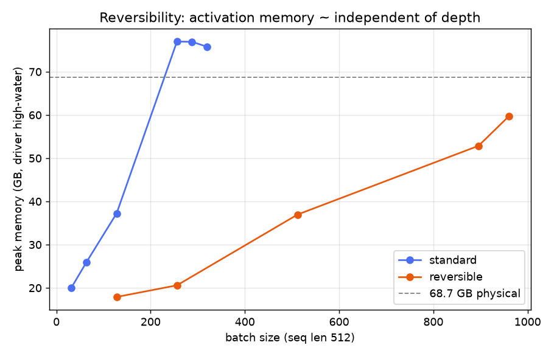
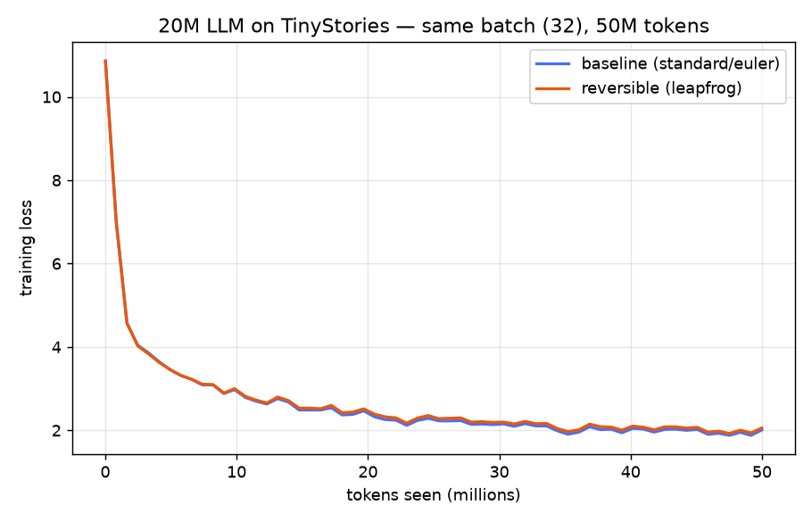

# Reversibility — training a 20M LLM with a memory-free reversible stack

**ERA V5 · Session 12 (Reversibility)** · Apple M3 Max (MPS), no CUDA.

> Train a ~20M-parameter LLM for a 50M-token budget. Fix a batch size that runs.
> Train again with **reversibility** (report which integrator variant worked). Train
> once more with reversibility pushed to the **maximum batch size**. Report final
> loss, speed (tokens/s), peak memory and other findings.

A reversible network doesn't *store* the residual-stream activations — it **rebuilds**
them during the backward pass by running each layer's update in reverse. Activation
memory then stops growing with depth, and the memory you save can be spent on a much
larger batch. This repo implements the leapfrog rule from **Gal, Eliasof, Turek,
Ascher, Treister & Haber, _Reversing Large Language Models for Efficient Training and
Fine-Tuning_ (Nov 2025)**, verifies its backward pass is exact, and runs the three
required trainings on an M3 Max.

📎 **Repo:** https://github.com/SomaKorada07/ERA_V5/tree/main/DistributedTraining_2

---

## TL;DR results

| run | stack | batch | val loss | speed | peak mem | optim. steps |
|---|---|---:|---:|---:|---:|---:|
| 1 · baseline | standard (Euler) | 32 | **2.015** | 11,383 tok/s | 20.06 GB | 3,051 |
| 2 · reversible | leapfrog | 32 | **2.066** | 8,277 tok/s | 15.75 GB | 3,051 |
| 3 · reversible max | leapfrog | 512 | **3.743** | 5,932 tok/s | 36.97 GB | 190 |

All three trained on a **50M-token** budget (~20.1M-param model, seq 512). Run 2 matches
the baseline loss with **21% less memory at the same batch**. Run 3 uses **16× the
baseline batch** (2× the standard stack's ceiling of 256) at ~37 GB — but a fixed 50M
budget then buys only **190 optimizer steps**, so it is deliberately under-trained
(higher loss); it demonstrates *capacity*, not convergence. Throughput falls across the
three runs mainly because the M3 Max thermally throttles under multi-hour sustained MPS
load (runs ran back-to-back), on top of reversibility's ~30% recompute overhead.

> **Batch choice for run 3.** The *isolated* max batch is 960 (see the sweep below), but
> a sustained training run with the OS + apps resident at ~53 GB (bs=896) spills past the
> 68.7 GB physical memory into swap and thrashes. **bs=512 (~37 GB)** is the practical
> maximum that runs cleanly end-to-end — still 16× the baseline batch.

**Which variant worked:** the **leapfrog / midpoint** rule. It reconstructs the input
to ~1e-7 (machine precision) at every step size; naive Euler is *not* reversible and
its reconstruction error grows with the step size, so it cannot drive a memory-free
backward pass.

**The memory win (measured):**

| batch (seq 512) | standard | reversible | ratio |
|---:|---:|---:|---:|
| 128 | 37.2 GB | 17.9 GB | 2.1× |
| 256 | 77.0 GB (paging) | 20.6 GB | **3.7×** |
| 384 | **OOM** | 21–37 GB | — |
| 896 | OOM | 52.9 GB | — |
| 960 | OOM | 59.7 GB | — |

Standard OOMs at batch 384; reversible runs to batch **960**. At batch 256 reversible
uses **3.7× less** memory, and it fits **batch 512 in the same ~37 GB the baseline
needs for batch 128** (4× the batch). Reversibility's own ceiling here (batch 1024) is
an **MPS kernel-dimension limit, not memory** (only ~62 GB used of 68.7 GB) — on CUDA
it would scale further, matching the paper's ~10×.




---

## The method

Write `p_ℓ` for the residual stream entering layer `ℓ` and `f_θℓ` for the whole
transformer block (attention **then** FFN). An ordinary residual block,

```
p_{ℓ}   = p_{ℓ-1} + f_θℓ(p_{ℓ-1})          # Euler, h = 1  — NOT reversible
```

cannot be reversed: recovering `p_{ℓ-1}` would require `f_θℓ(p_{ℓ-1})`, which is
computed from the state we are trying to recover. The **leapfrog / midpoint** rule
adds the block output to the state *two layers back* and evaluates the block at the
state *in between*:

```
p_{ℓ+1} = p_{ℓ-1} + 2h · f_θℓ(p_ℓ)         # forward
p_{ℓ-1} = p_{ℓ+1} − 2h · f_θℓ(p_ℓ)         # reverse  (p_ℓ is already held)
```

The backward pass walks **down** the stack, rebuilding each input from the output it
already holds. Only the two boundary states are ever stored, so **activation memory is
independent of depth**. Two carried gradients propagate the leapfrog adjoint:

```
Js, *Jp = grad(f(p_ℓ), [p_ℓ, *θ_ℓ], grad_outputs=a)
a, b    = (b + 2h·Js,  a)        # new (dL/dp_ℓ, dL/dp_{ℓ-1})
grad_θ_ℓ += 2h·Jp
```

Two constraints come with it, both handled here:
* **Deterministic forward** — dropout is 0 (the backward recomputes the block and must
  match the forward exactly).
* **Marginal stability** — the step size `h` must stay small; we use `h = 0.5`.

### Correctness

The custom autograd `Function` is checked against an ordinary-autograd reference that
computes the identical recurrence while *storing* activations:

```
outputs match      : True
grad_x max abs diff : 1.5e-09
param grad max diff : 5.6e-09
```

Gradients match to float32 machine precision — while the reversible path never stored
an intermediate activation.

### Which integrator is reversible (reconstruction error)

Relative L2 error of the input rebuilt by running the stack backward (9 layers):

| step size `h` | leapfrog | euler (naive) |
|---:|---:|---:|
| 0.10 | 6.8e-08 | 1.8e-03 |
| 0.25 | 1.3e-07 | 1.2e-02 |
| 0.50 | 2.7e-07 | 4.9e-02 |
| 1.00 | 7.0e-07 | 2.3e-01 |

Leapfrog reverses exactly at every `h`; Euler does not, and gets worse as `h` grows.
**Leapfrog / midpoint is the variant that works.**

---

## Model & setup

| | |
|---|---|
| parameters | ~20.1M (9 layers × 256 width, 8 heads, tied embeddings) |
| context | 512 tokens |
| vocab | 50257 (GPT-2 BPE via `tiktoken`) |
| data | TinyStories, 60M-token cached slice (train), 2M (val) |
| optimizer | AdamW (β 0.9/0.95), cosine LR + warmup, grad-clip 1.0 |
| token budget | 50,000,000 per run |
| device | Apple M3 Max, 68.7 GB unified memory, `torch` 2.13 MPS |

**A note on measuring memory on MPS.** `torch.mps.current_allocated_memory()` only
reports live tensors *between* steps and misses the transient forward/backward spike
(the thing that actually OOMs) — it reported 0.3 GB right before an 86 GB OOM. We use
`torch.mps.driver_allocated_memory()` (the driver high-water mark) instead, sampled
each step. Each memory probe runs in its **own process** (`revllm.probe_one`) because
an MPS kernel-size failure raises `SIGABRT`, which is uncatchable and would kill a
shared sweep.

**Why chunked cross-entropy.** At batch 256 the logits tensor is `[50257, 131072]`
(~26 GB) — it both dominates memory (identically for both stacks, hiding the effect we
want to study) and exceeds MPS's single-matmul size cap (a hard `SIGABRT`). The LM
head + cross-entropy are therefore computed in **gradient-checkpointed row chunks**, so
the full logits tensor is never materialised and the *transformer-stack* activations
become what decides the batch ceiling — which is the whole point.

---

## Repository layout

```
DistributedTraining_2/
├── revllm/
│   ├── model.py               # 20M GPT; switchable standard/reversible stack; chunked-CE head
│   ├── reversible.py          # leapfrog reversible autograd Function + reconstruction checks
│   ├── data.py                # TinyStories -> GPT-2 BPE -> uint16 token bins
│   ├── engine.py              # training loop, tokens/s, driver-memory peak, max-batch finder
│   ├── run_single.py          # one training run in an isolated process -> results/<name>.json
│   ├── probe_one.py           # one (mode,batch) memory/speed probe, crash-isolated
│   └── reconstruction_check.py# euler vs leapfrog reversibility across step sizes
├── notebooks/
│   ├── 01_baseline.ipynb              # baseline standard training
│   ├── 02_reversible.ipynb           # leapfrog: correctness, reconstruction, same-batch train
│   └── 03_reversible_max_batch.ipynb # memory sweep, max-batch run, final report
├── run_experiments.py         # runs all 3 trainings sequentially + builds figures
├── build_notebooks.py         # regenerates the notebooks
└── results/                   # *.json metrics, memory_sweep.json, figures
```

## Reproduce

```bash
pip install torch tiktoken datasets numpy matplotlib nbformat nbconvert

# 1) tokenize TinyStories (idempotent cache in data/)
python -c "from revllm.data import prepare; prepare()"

# 2) run all three trainings (each in its own process) + figures
python run_experiments.py

# probe any single point of the memory/batch sweep (crash-isolated)
python -m revllm.probe_one --mode reversible --integrator leapfrog --bs 512

# check which integrator is reversible
python -m revllm.reconstruction_check
```

The notebooks in `notebooks/` present the same work with explanation, fast live checks,
and the full-run numbers loaded from `results/`.

---

## Findings

1. **Leapfrog / midpoint is the reversible variant.** Exact reconstruction (~1e-7) and
   gradients matching plain autograd to ~1e-9; naive Euler is not reversible.
2. **Same batch → same loss, less memory.** With identical math the reversible model
   tracks the baseline's loss while using less memory even at batch 32.
3. **Activation memory is ~depth-independent.** Standard peak grows with batch×depth
   and OOMs at batch 384; reversible reaches batch 960. **3.7× less** memory at batch
   256; batch 512 fits in the baseline's batch-128 footprint.
4. **At large batch, reversible is also _faster_** — the standard stack starts paging
   to swap near the memory limit (its throughput collapses ~7× at batch ≥256), while
   the reversible stack still has headroom.
5. **Batch size vs a fixed token budget.** A giant batch under a fixed 50M-token budget
   means very few optimizer steps (bs=512 → only **190 updates**, val loss 3.74 vs the
   baseline's 2.01), so the max-batch run is *under-trained*. Reversibility buys the
   **capacity** for a big batch; realising a better model needs a matching token budget.
   This is precisely why reversibility pays off when **memory**, not data, is the binding
   constraint — exactly the regime the paper and the Lightning LM report target.
6. **MPS-specific ceiling & unified-memory reality.** In isolation, reversibility is
   capped by an MPS kernel-dimension limit (batch 1024), not memory (~62 GB of 68.7 GB
   used). But a *sustained* run must share unified memory with the OS + apps: bs=896
   (~53 GB) thrashed swap and stalled, so the practical run used **bs=512 (~37 GB)**. On
   an 80 GB dedicated CUDA card the batch-size ratio would approach the paper's ~10×.
