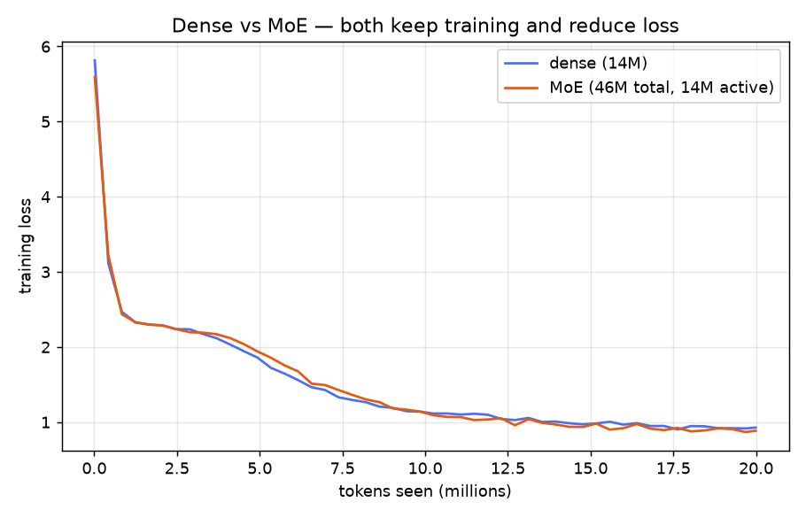
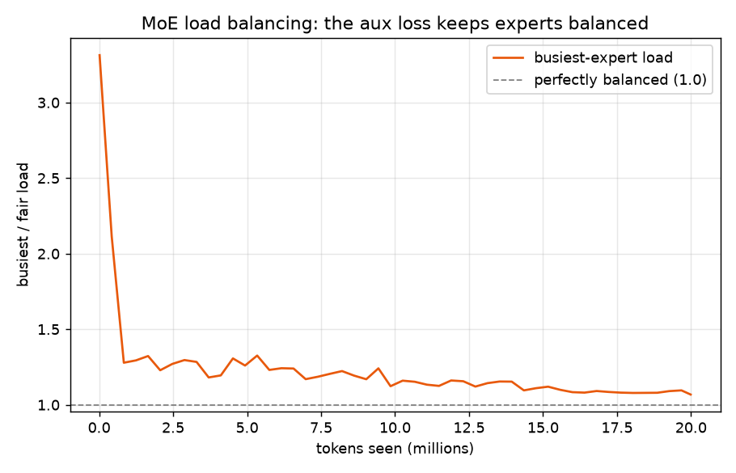

# Mixture-of-Experts — converting a dense feed-forward into a router + experts

**ERA V5 · Session 14 (Mixture-of-Experts)** · Apple M3 Max (MPS), no CUDA.

> Train a "linear"/dense model and convert it into a Mixture-of-Experts. Your call on
> model size and data — but show that **both keep training and reduce loss**.

A Mixture-of-Experts layer keeps attention unchanged and replaces the one dense
feed-forward network with a **router + N experts**: for each token the router scores
every expert, keeps the **top-k**, and sums those experts' outputs weighted by the
router. That raises total capacity while keeping the compute per token small. This repo
starts from a small dense Transformer LM, converts its SwiGLU FFN into an MoE layer
(8 experts, top-2), and trains both on byte-level TinyStories.

📎 **Repo:** https://github.com/SomaKorada07/ERA_V5/tree/main/MixtureOfExperts

---

## TL;DR results

| model | total params | active / token | final val loss | speed |
|---|---:|---:|---:|---:|
| dense (SwiGLU FFN) | 14.5M | 14.5M | **0.931** | 24,029 tok/s |
| MoE (8 experts, top-2) | 46.3M | 14.5M | **0.890** | 17,314 tok/s |

Both models train and reduce loss. The MoE holds **~3× the parameters** of the dense
model at the **same active compute per token** (top-2 of 8 experts, each expert half the
dense width), its routing stays balanced throughout training, and it reaches a **lower
validation loss (0.890 vs 0.931)**.




---

## What "converting to MoE" means here

The two models are identical except for the feed-forward block:

**Dense** — one SwiGLU network per layer:
```
E(x) = W_down( SiLU(W_gate x) ⊙ W_up x )
```

**MoE** — a router picks the top-k of N experts and sums their outputs:
```
scores  = softmax(router · x)         # one score per expert
T       = indices of the top-k scores # k experts kept
g_i     = scores_i / Σ_{j∈T} scores_j # renormalised router weights
y       = Σ_{i∈T} g_i · E_i(x)        # weighted sum of the chosen experts
```
Each `E_i` is its own SwiGLU network. With **8 experts, top-2**, and each expert half
the dense hidden width, the **active** parameters per token equal the dense model while
the **total** parameter count is much larger — the whole point of MoE.

### Load balancing

Left alone the router collapses onto a few favourite experts. We add the Switch-style
auxiliary loss from the notes:
```
L_aux = α · N · Σ_i f_i · P_i          (α = 0.01, N = number of experts)
```
where `f_i` is the fraction of tokens routed to expert `i` (no gradient — top-k is a
step) and `P_i` is its mean router probability (has gradient). Minimising `f·P` lowers
the probability of busy experts and raises it for idle ones. In training the busiest-
expert load falls from ~3.3× a fair share toward **1.0**, with **no dead experts**.

### Sparse dispatch (and an MPS caveat)

The MoE dispatches each token only to its top-k experts (`routing="sparse"`), so the
per-token compute matches the dense FFN. We verify this equals the simple
"compute every expert then mask" reference to ~1e-7. On MPS, sparse dispatch uses
dynamic per-expert shapes that the backend recompiles each step, so its **wall-clock
does not beat the dense model on this Mac** — the FLOP / active-parameter savings are
real and would show on a CUDA GPU. A fixed-shape `routing="masked"` path is included for
comparison.

---

## Model & setup

| | |
|---|---|
| architecture | 6-layer GPT, width 384, 6 heads, context 512 |
| feed-forward | dense SwiGLU (hidden 1536) → MoE (8 experts × width 768, top-2) |
| vocab | 256 (byte-level UTF-8) |
| data | TinyStories, 40M bytes train / 2M val |
| optimizer | AdamW, cosine LR + warmup, grad-clip 1.0 |
| token budget | 20,000,000 per model |
| device | Apple M3 Max, MPS backend, `torch` 2.13 |

---

## Repository layout

```
MixtureOfExperts/
├── moe/
│   ├── model.py        # GPT with dense OR MoE feed-forward; router; SwiGLU experts; aux loss
│   ├── data.py         # TinyStories -> raw UTF-8 byte token bins
│   └── engine.py       # training loop, loss/throughput logging, routing stats, upcycling
├── notebooks/
│   ├── 01_dense_baseline.ipynb     # the dense "linear" model
│   ├── 02_moe_layer.ipynb          # convert FFN -> router+experts, balancing, sparse check
│   └── 03_comparison_report.ipynb  # dense vs MoE, final report
├── run_experiments.py  # trains both, writes results + figures
├── build_notebooks.py  # regenerates the notebooks
└── results/            # *.json metrics + figures
```

## Reproduce

```bash
pip install torch datasets numpy matplotlib nbformat nbconvert
python -c "from moe.data import prepare; prepare()"   # cache TinyStories bytes
python run_experiments.py                             # train dense + MoE, make figures
```

---

## Findings

1. **Both keep training and reduce loss** — the dense model and the converted MoE model
   both drive training loss down smoothly on TinyStories (val 0.931 and 0.890).
2. **More capacity at equal active compute — and lower loss.** The MoE has ~3× the total
   parameters of the dense model but the same active parameters per token, and it reached
   a **lower validation loss (0.890 vs 0.931)** — the extra capacity pays off exactly as
   MoE promises.
3. **Routing stays balanced** — the auxiliary loss pushes the busiest-expert load from
   ~3.3× toward **1.07** (1.0 = perfect) with no dead experts, so every expert learns.
4. **Sparse routing is exact** — dispatching only the chosen experts matches the
   compute-all reference to ~1e-7.
5. **MPS caveat** — sparse dispatch's dynamic shapes are recompiled by MPS, so the
   compute saving doesn't translate to wall-clock on this Mac; it would on CUDA.
