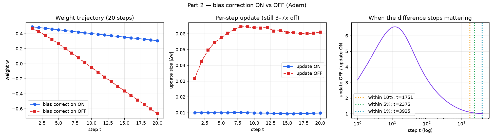
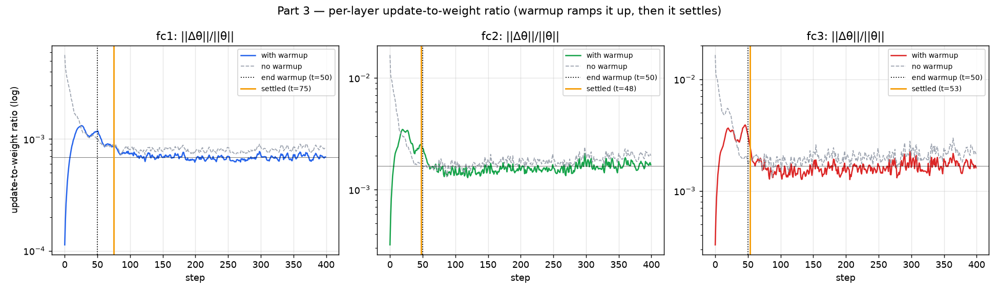
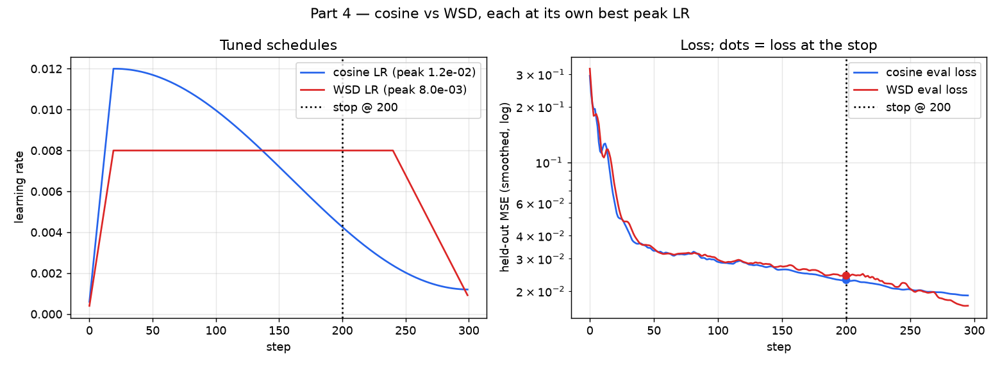
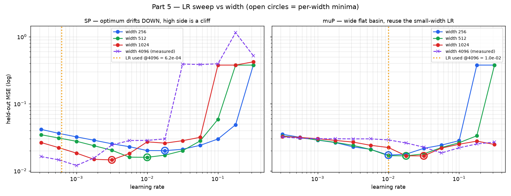

# Optimizers & LR Schedules — Adam from scratch, warmup, WSD, and width transfer

Six experiments that take Adam apart and put learning-rate schedules under
control. Everything is small, CPU-deterministic, and reproduces end-to-end in a
few minutes. Every number below is copied from an **actual run** — re-run
`python3 run_all.py` to refresh them.

> **The one rule this assignment is built around:**
> *Tune both sides before accepting a comparison.* Almost every optimizer claim
> that failed to replicate was a **well-tuned method measured against a
> badly-tuned one**. In Part 4 that rule literally flips the answer (see the
> tuning note), and in Part 5 it is the difference between a safe LR and a
> divergent one.

## What's here

| File | Part | What it does |
|---|---|---|
| `common.py` | — | Teacher/student data, width-parametric MLP (SP **and** muP), LR schedules |
| `part1_2_adam_by_hand.py` | 1, 2 | Adam by hand vs PyTorch; bias correction ON vs OFF |
| `part3_update_ratio.py` | 3 | Per-layer update-to-weight ratio; when warmup stops mattering |
| `part4_cosine_vs_wsd.py` | 4 | Cosine vs WSD, both tuned, stopped at step 200 |
| `part5_lr_sweep_mup.py` | 5 | LR sweep at widths 256/512/1024, transfer to 4096 (SP vs muP) |
| `run_all.py` | all | Runs everything; writes `assets/*.png` and `assets/*.json` |

```bash
python3 run_all.py            # everything (~4–5 min on a laptop, CPU)
python3 part1_2_adam_by_hand.py   # or any part on its own
```

**Setup.** A fixed random 2-layer tanh **teacher** generates a regression signal;
a **student** MLP (`in=32 → width → width → 1`, GELU) learns it. Parts 3–5 use a
fresh minibatch each step (the infinite-data / streaming regime), so the model
never overfits and the diagnostics look like real training logs. Device is CPU
on purpose — the numbers are bit-reproducible.

---

## Part 1 — Adam by hand, checked against PyTorch

One weight `w₀ = 0.5`, five gradients `[0.1, −0.2, 0.05, 0.4, −0.15]`,
`lr = 0.01`, `β = (0.9, 0.999)`, `ε = 1e-8`. Computed **by hand** in pure Python
(`adam_by_hand`) and independently with `torch.optim.Adam` driven by the same
gradients.

The update rule, per step *t*:

```
m  = β1·m + (1−β1)·g
v  = β2·v + (1−β2)·g²
m̂ = m / (1−β1ᵗ)          v̂ = v / (1−β2ᵗ)
step = lr · m̂ / (√v̂ + ε)     w ← w − step
```

Actual output:

```
 t       g           m            v       m_hat        v_hat         step      w_hand     w_torch     |Δw|
 1   0.100   0.0100000   0.00001000   0.1000000   0.01000000   0.01000000   0.4900000   0.4900000   0.00e+00
 2  -0.200  -0.0110000   0.00004999  -0.0578947   0.02500750  -0.00366104   0.4936610   0.4936610   0.00e+00
 3   0.050  -0.0049000   0.00005244  -0.0180812   0.01749749  -0.00136691   0.4950279   0.4950279   0.00e+00
 4   0.400   0.0355900   0.00021239   0.1034894   0.05317660   0.00448782   0.4905401   0.4905401   0.00e+00
 5  -0.150   0.0170310   0.00023468   0.0415887   0.04702900   0.00191775   0.4886224   0.4886224   0.00e+00
```

**`max |hand − torch|` across m, v, w over all steps = `3.469e-18`** → agreement
to machine precision (the assignment asked for "several decimal places"; this is
~17). Note step 2's update *grows* `w` even though we subtract `step`: `m̂` is
negative there, so `−step` is positive. That sign bookkeeping is exactly the kind
of thing hand-reproduction catches.

📈 See also the per-step JSON in [`assets/part1_2_results.json`](assets/part1_2_results.json).

---

## Part 2 — bias correction ON vs OFF

Same optimizer, 20 steps, on a near-constant gradient stream. With correction
**off** we simply use `m, v` in place of `m̂, v̂`.



The per-step ratio of the two updates is **exact and gradient-independent**
(ε aside):

```
step_off / step_on = (1 − β1ᵗ) / √(1 − β2ᵗ)
```

The measured `off/on` column matches this closed form to 3 decimals at every
step. First few steps:

```
  t      step_on     step_off    off/on   (1-b1^t)/√(1-b2^t)
  1   0.01000000   0.03162268     3.162               3.162
  5   0.00992200   0.05751918     5.797               5.797
 10   0.00975938   0.06370802     6.528               6.528
 20   0.00978719   0.06108114     6.241               6.241
```

**When does the difference stop mattering?** *Not within the plotted 20 steps* —
the uncorrected update is still **3–7× too large** there. The governing timescale
is set by **β2**, not β1, because `√(1−β2ᵗ)` in the denominator decays slowly:

| tolerance | step after which OFF ≈ ON |
|---|---|
| within 10% | **t ≈ 1751** |
| within 5% | **t ≈ 2375** |
| within 1% | **t ≈ 3925** |

For contrast, the `1/(1−β1ᵗ)` factor alone would be within 1% by **t ≈ 44** — so
if Adam only had a first-moment bias it would settle almost immediately. It's the
second moment (β2 = 0.999) that makes early uncorrected steps blow up, which is
why bias correction matters most in the *first few thousand* steps and is
irrelevant by the end of a long run.

---

## Part 3 — update-to-weight ratio per layer, and when warmup stops changing it

We log the **RMS update-to-weight ratio** `‖Δθ‖ / ‖θ‖` for every layer each step.
This is the quantity muP tries to hold constant across width and the one a warmup
schedule is really steering. Schedule: 50-step linear warmup → constant LR
(`3e-3` peak base, but Part 3 uses `1e-3`); 400 steps; fresh data each step.



To pin down "when warmup **stops changing** it" we also run a **no-warmup
control** (constant LR from step 0), everything else identical.

| layer | peak ratio (warmup run) | operating band | warmup-settle step |
|---|---|---|---|
| fc1 | 1.32e-03 | 6.84e-04 | **75** |
| fc2 | 3.45e-03 | 1.63e-03 | **48** |
| fc3 | 3.89e-03 | 1.68e-03 | **53** |

**Reading it:**
- The ratio **ramps up during warmup, overshoots (peaks mid-ramp ~step 25), then
  relaxes into a steady operating band** and holds. It settles by **step ~75** —
  roughly one warmup-length past the end of the 50-step ramp, because Adam's
  `m`/`v` buffers carry ~`1/(1−β)` steps of memory of the earlier (smaller) LRs.
- **The no-warmup control spikes to `1.6e-2` at step 0** — ~20× the operating
  band. *That step-0 spike is exactly what warmup exists to suppress.* Warmup's
  whole job is to keep this ratio from exploding while `v` is still a poor
  estimate (cf. Part 2 — early `v̂` is unreliable).

So warmup stops changing the update-to-weight ratio at **step ≈ 75** (per-layer
48–75), which is the end of the ramp plus the optimizer's memory tail.

---

## Part 4 — cosine vs WSD, 300-step budget, both stopped at step 200

Same model, same seed, same per-step data — only the LR schedule differs. WSD =
Warmup → Stable plateau → Decay (last 20%, steps 240–300). **Both schedules'
peak LR is tuned independently** over a grid (this is the "tune both sides" step),
each to minimize held-out loss at its designed 300-step horizon.



**Peak-LR tuning** (held-out loss @ step 300; interior optima, not grid edges):

```
cosine: 3e-3→0.0255  5e-3→0.0234  8e-3→0.0211  1.2e-2→0.0189  1.8e-2→0.0193   best = 1.2e-2
WSD:    3e-3→0.0208  5e-3→0.0184  8e-3→0.0167  1.2e-2→0.0167  1.8e-2→0.0178   best = 8e-3
```

**Results, each schedule at its own best peak LR:**

| | LR @ step 200 | **loss @ step 200** | loss @ step 300 |
|---|---|---|---|
| **cosine** (peak 1.2e-2) | 0.00426 | **0.02298** ✅ | 0.01894 |
| **WSD** (peak 8e-3) | 0.00800 | 0.02426 | **0.01666** ✅ |

- **At the forced stop (step 200), cosine is lower** (0.02298 vs 0.02426, by
  5.6%). Cosine has already annealed its LR to `0.0043`; WSD is still on its high
  `0.008` plateau and *hasn't started its decay*, so it's noisier and less
  settled.
- **At the full horizon (step 300), WSD is lower** (0.01666 vs 0.01894) — its
  sharp late decay is very effective once it fires.

**Which model would I keep?**
- **Hard stop at 200, ship as-is → keep cosine.** It's the lower-loss model at
  the moment you're forced to stop.
- **If you can still train → keep WSD's stable checkpoint.** Its LR budget is
  unspent and it was never locked to the 300-step horizon. To prove this isn't
  hand-waving, I **re-planned WSD to decay by step 200** (tuned peak 1.8e-2):
  loss @ 200 = **0.02248**, which **beats cosine's 0.02298**. So the deciding
  factor was *horizon commitment*, not the schedule shape: cosine only wins at
  200 because it happened to be told the horizon in advance. Move the stop and
  cosine must be re-planned from scratch; WSD just moves its short decay.

> **Tune-both-sides note.** Before tuning (both schedules pinned at a shared
> `3e-3`), **WSD was lower at step 200**. Properly tuning each schedule's peak LR
> **flipped the step-200 winner to cosine.** That is this assignment's warning in
> one experiment: an untuned baseline can hand you the opposite conclusion.

---

## Part 5 — LR sweep vs width, and transfer to width 4096

Sweep the LR at widths **256, 512, 1024**, plot loss vs LR, mark the three
minima, and state the LR to use at **4096**. Done under **two parametrizations**,
because "tune both sides" here means *tune the parametrization too*:

- **SP** (standard): the optimal LR **drifts** with width.
- **muP** (maximal update): init + per-layer LR multipliers (`1/width_mult` on
  hidden & readout weights, `1/width_mult` output multiplier, zero readout init;
  biases keep the full base LR) are set so the optimum is width-*stable*.

Then we **actually train width 4096** on the full grid to check the prediction —
turning "confidence" into a measured penalty.



**Per-width optima (open circles in the figure):**

| width | SP optimum LR | muP optimum LR |
|---|---|---|
| 256 | 1.78e-2 | 1.0e-2 |
| 512 | 1.00e-2 | 1.78e-2 |
| 1024 | 3.16e-3 | 3.16e-2 |
| **4096 (measured)** | **1.0e-3** | **5.6e-2** |

**What the sweep shows at width 4096:**

| | best LR | best loss | basin within 1.5× of best | reuse width-256 LR |
|---|---|---|---|---|
| **SP** | 1.0e-3 | 0.0120 | narrow — **6×** (3.2e-4…1.8e-3) | LR 1.8e-2 → 0.030 (2.5× worse), and just above it is a **cliff**: LR 3.2e-2 → **0.39 (diverged)** |
| **muP** | 5.6e-2 | 0.0185 | wide — **18×** (1.8e-2…3.2e-1) | LR 1.0e-2 → 0.029 (1.6× worse), **nothing diverges** |

- **SP: the optimum marches down** ~1 order of magnitude from width 256 (1.8e-2)
  to 4096 (1.0e-3) — a clean, monotone log-linear drift (slope −0.38 per
  width-doubling). You **must** scale the LR down as you widen, and the **high
  side is a cliff**: reusing the small-width LR at 4096 sits at 2.5× worse loss
  with divergence one grid-step higher.
- **muP: the basin is wide and flat and never diverges.** Any LR from 1.8e-2 to
  3.2e-1 is within 1.5× of the best loss. The optimum no longer forces you *down*
  with scale; a 2–3× miss costs almost nothing.

### The value I'd use at width 4096, and how confident I am

- **Preferred — muP, base LR ≈ `1.0e-2`** (the value that was optimal at 256 and
  512, reused unchanged). **Confidence: HIGH** that it's *safe and near-optimal*
  — the 4096 muP basin within 1.5× of best spans 18×, and nothing blows up, so a
  2–3× error is free. This is the whole point of muP: **tune small, transfer**.
- **If constrained to SP — LR ≈ `6e-4`–`1e-3`**, from extrapolating the clean
  downward drift (log-linear fit → 6.2e-4; measured optimum 1.0e-3, within ~1.6×).
  **Confidence: MODERATE, and deliberately biased LOW** — the SP basin is narrow
  (6×) and the high side diverges, so if you must miss, miss *low*.

**Honest caveat.** On this short-horizon toy, SP *tuned to its exact 4096
optimum* reaches a slightly lower loss (0.0120) than muP's best (0.0185) — muP's
zero-init `1/width_mult` readout is throttled over only 300 steps. muP's win here
is **transfer robustness** (wide basin, no divergence, no forced LR decrease),
which is exactly the property you buy it for, not a lower absolute floor on a
300-step run.

---

## The through-line

1. **Adam is exactly reproducible** (Part 1) — if your hand math and the library
   disagree past machine epsilon, the bug is yours to find.
2. **Bias correction is a first-few-thousand-steps phenomenon governed by β2**
   (Part 2), not β1, and not a rounding detail early on.
3. **Warmup controls the update-to-weight ratio**, suppressing a ~20× step-0
   spike, and stops mattering ~one warmup-length after the ramp (Part 3).
4. **Schedule comparisons depend on the stopping horizon**, and **tuning both
   sides can flip the winner** (Part 4).
5. **LR transfer across width is a parametrization choice**: SP makes you
   extrapolate down a cliff; muP lets you reuse a small-width LR into a wide flat
   basin (Part 5).

Across Parts 4 and 5, the recurring lesson is the header: **tune both sides, or
the comparison isn't real.**
