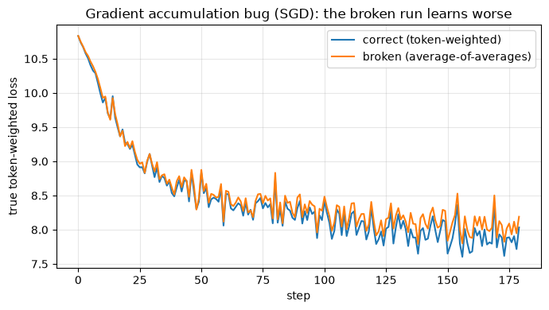
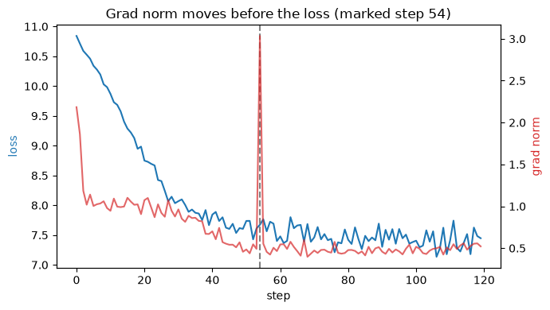

# Assignment 10 — Make the training loop tell the truth about itself

A small **nanoGPT / GPT-2** model and a **real training loop**, instrumented so it reports on itself.

- **Architecture:** nanoGPT / GPT-2 (pre-LN blocks, causal self-attention, GELU MLP, weight-tied head, std=0.02 init).
- **Data:** **FineWeb** (`HuggingFaceFW/fineweb`, `sample-10BT`) — *streamed*, no multi-GB download.
- **Verified end-to-end on an Apple M3 Max (MPS), 0 errors.**

📓 **Notebook:** [`TheTrainingLoop.ipynb`](./TheTrainingLoop.ipynb) — runs top to bottom.
🧾 **Full run log:** [`assets/run_log.txt`](./assets/run_log.txt)
📈 **Plots:** [`accum_gap.png`](./assets/accum_gap.png) · [`gradnorm.png`](./assets/gradnorm.png)

> **The rule for the whole assignment.** Every serious training bug is *silent*. The loss curve is not
> the one that tells you. So we **print things and check things** at every step. All numbers below are
> the actual outputs from the executed notebook.

---

## 1. Every tensor shape in one step, each dimension named

```
--- inputs ---
idx (tokens)        (8, 64)          (B batch, T sequence length)
targets             (8, 64)          (B, T) each is the NEXT token
--- embeddings ---
wte(idx) token emb  (8, 64, 128)     (B, T, C=n_embd)
wpe positional emb  (64, 128)        (T, C) added per position
hidden x            (8, 64, 128)     (B, T, C)
--- inside attention (block 0) ---
c_attn qkv          (8, 64, 384)     (B, T, 3C) query|key|value packed
q per head          (8, 4, 64, 32)   (B, nh heads, T, hd head_dim)
attn output         (8, 4, 64, 32)   (B, nh, T, hd) causal-masked mix
--- head + loss ---
logits              (8, 64, 50257)   (B, T, V vocab) score per next-token
shift logits        (504, 50257)     (B*(T-1), V) predictions
shift targets       (504,)           (B*(T-1),) gold next ids
loss                ()               scalar cross-entropy = 10.8468
--- gradients (after backward) ---
lm_head.weight.grad (50257, 128)     (V, C) dL/dW, same shape as the weight
blocks[0] c_fc.grad (512, 128)       (4C, C) same shape as its weight
```
**Check:** every gradient tensor has *exactly* the shape of its parameter. If one doesn't, something is
broadcasting silently — the loss won't tell you.

---

## 2. Verify one gradient by hand

Nudge one weight by `±eps`, central-finite-difference the loss, compare to `backward()`. Done in
**float64 on CPU** so rounding doesn't muddy the comparison.

```
weight: blocks[0].mlp.c_fc.weight[5,7]
  L(w+eps) = 10.810915079666
  L(w-eps) = 10.810915085133
  finite-difference grad = -0.002733360205
  backward() grad        = -0.002733360923
  |difference|           = 7.18e-10
  agree to ~9.1 decimals  -> autograd is telling the truth
```

---

## 3. Break gradient accumulation on purpose

Micro-batches of **different lengths** carry **different token counts**. The correct accumulated
gradient is **token-weighted** (sum every token's loss, divide by total tokens). The common bug is
**average-of-averages** (average each micro-batch's mean loss equally), which over-weights short
micro-batches.

**One accumulation step — losses *and* gradient directions:**
```
micro-batch lengths: [8, 64, 16, 64] | token counts: [28, 252, 60, 252] | total: 592
correct (token-weighted)  loss = 10.84334
wrong   (avg-of-averages) loss = 10.83496   gap = -0.00838
gradient cosine similarity = 0.83079   (1.0 = identical)
gradient norms correct/wrong = 3.1068 / 3.7770
```
The gradients point in **different directions** (cosine 0.83, not 1.0) — the bug changes *what the model
learns*, silently.

**Both curves, trained side by side (SGD):**



```
final TRUE token-weighted loss  correct=8.034  wrong=8.190  gap=+0.156
best  TRUE token-weighted loss  correct=7.604  wrong=7.793
```
The broken (orange) run sits **above** the correct (blue) run — it converges worse on the true
token-weighted objective.

> **Key subtlety (and a real finding):** *Adam nearly hides this bug.* Adam normalizes each parameter's
> update by a running estimate of the gradient's own scale, so a constant global reweighting mostly
> cancels — with Adam the final gap was only ~0.001. Plain **SGD** feeds the wrong scale/direction
> straight into the step, so it *exposes* the bug. Choosing SGD here is the difference between seeing the
> bug and having the optimizer paper over it.

---

## 4. Grad norm as a leading indicator

Log **loss** and **global grad norm** every step. They live on different scales, so compare their
**relative** step-to-step changes. We find a step where the grad norm moved sharply while the loss was
flat — and the loss dropped afterward.



```
step 54: grad norm moved 517.0%  while loss moved only 0.82%  (flat)
  grad norm: 0.492 -> 3.034
  loss:      7.610 -> 7.672   then drops to 7.563 by step 57
  => the grad norm moved BEFORE the loss did.
```
The grad norm spiked (the model hit a high-curvature region and made a large update) a few steps before
that showed up as a loss decrease. The loss average lags; the grad norm leads.

---

## 5. Model FLOPs Utilization (MFU), honestly

MFU = FLOPs actually performed per second ÷ hardware peak FLOPs. FLOPs/token uses nanoGPT's
`6·N + 12·L·H·Q·T` (fwd+bwd); tokens/sec is measured from the real loop.

```
chip: Apple M3 Max  (assumed peak 14.2 TFLOPS FP32 -- an ESTIMATE)
params N            = 7,242,624
flops/token (6N+..) = 43,848,960
tokens/sec          = 29,093
achieved FLOPS      = 1.276 TFLOP/s
MFU                 = 8.98%
```

**Why we're far from 40% (honest):**
- **Tiny model** (128-dim, 4 layers): matmuls too small to saturate the GPU; kernel-launch and
  Python-loop overhead dominate each step.
- **Small batch/seq (16×64):** low arithmetic intensity → memory-bandwidth bound, not compute bound.
- **MPS eager mode:** no operator fusion / graph capture (no `torch.compile` on MPS here); the huge
  `(B·T, 50257)` logits+softmax is largely a bandwidth-bound op the `6N` FLOP model ignores.
- **fp32 on an Apple GPU:** no low-precision matrix acceleration to raise the ceiling.
- **To approach 40%:** bigger `d_model`/batch, fused/compiled kernels, and lower precision.

*(Peak FLOPS is an estimate — Apple doesn't publish a clean bf16 matrix-throughput figure, and the M3
Max GPU has no NVIDIA-style tensor cores, so bf16 ≈ fp32 throughput here. MFU scales inversely with
whatever peak you assume; the qualitative story doesn't change.)*

---

## 6. The number 0.1 in fp32, bf16, and fp8 E4M3

`0.1` is not exactly representable in binary (`0.000110011…` repeating). Layout is
`sign | exponent | mantissa`; value = `(-1)^s · 1.mantissa · 2^(exp − bias)`.
By hand: `0.1 = 1.6 × 2^-4` → unbiased exponent **−4**, fraction after the leading 1 is **0.6**.

```
fp32   0.1 = 0 01111011 10011001100110011001101
           = exp 123-127=-4, 23-bit mantissa -> 0.10000000149011612
bf16   0.1 = 0 01111011 1001101
           = same exponent as fp32, mantissa truncated 23->7 bits -> 0.10009765625
fp8    0.1 = 0 0011 101
           = exp 3-7=-4, mantissa 5/8=0.625 -> 0.1015625   (torch float8_e4m3fn confirms)

Rounding error vs true 0.1:   fp32 1.49e-09   bf16 9.77e-05   fp8 1.56e-03
```

| format | sign | exponent (bias) | mantissa | 0.1 stored as | error |
|--------|------|-----------------|----------|---------------|-------|
| fp32     | 1 | 8 (127) | 23 | `0 01111011 10011001100110011001101` | 1.5e-09 |
| bf16     | 1 | 8 (127) | 7  | `0 01111011 1001101` | 9.8e-05 |
| fp8 E4M3 | 1 | 4 (7)   | 3  | `0 0011 101` | 1.6e-03 |

### Which would I train in? **bf16** (with fp32 master weights + fp32 accumulation).
- **bf16 over fp32:** bf16 keeps fp32's *full 8-bit exponent* → same dynamic range (~1e-38…3e38), so it
  doesn't overflow/underflow where training lives; it only sacrifices mantissa precision, which SGD/Adam
  tolerate well. Half the memory and bandwidth — and bandwidth is exactly what bounds us (see §5).
- **not fp8 E4M3:** 3 mantissa bits, 4-bit exponent (max ≈ 448). ~100× bf16's rounding error on 0.1, and
  range too small to hold gradients/optimizer state without per-tensor scaling. Useful only for specific
  scaled matmuls, never as the default training type.
- **not fp32:** correct but wasteful — 2× memory/bandwidth for precision the optimizer doesn't need.

---

## The theme
Every bug and dynamic here was **silent**: a wrong gradient direction (cosine 0.83), an accumulation bug
Adam would have hidden, a grad-norm spike the loss lagged by 3 steps, a fp8 rounding error 100× bf16's.
None of them raised an exception. The **prints and the by-hand checks** surfaced them — the loss curve
never would have.

---

## Run it
```bash
python3 -m venv .venv && source .venv/bin/activate
pip install torch tiktoken datasets matplotlib jupyter
jupyter notebook TheTrainingLoop.ipynb        # Run All
```
Auto-selects MPS on Apple Silicon. FineWeb is streamed (~60k tokens); falls back to a built-in corpus if
the Hub is unreachable. **Colab:** upload the `.ipynb` → Runtime → Run all.
